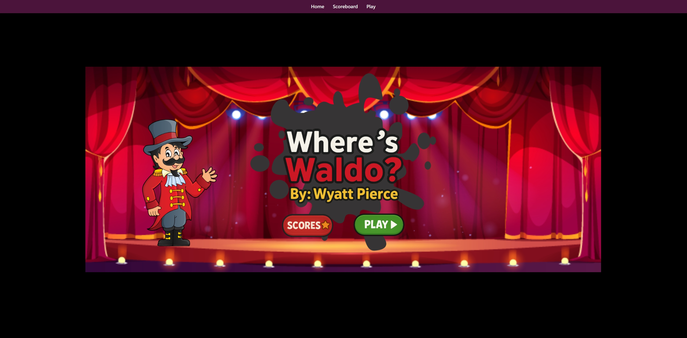
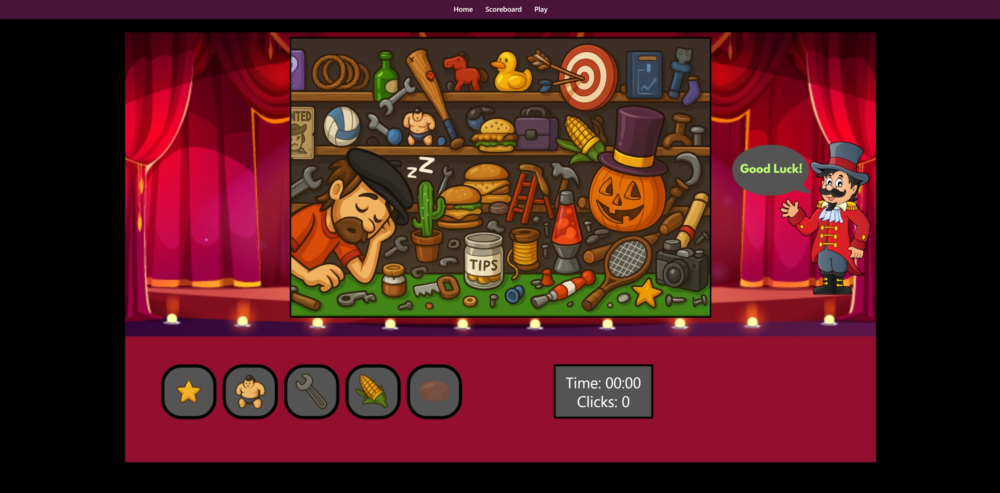

# Where's Waldo?

Where's waldo is a game that challenges the user to find the listed objects with the minimal amount of clicks and time.

## 📸 Preview

---

---

## 🚀 Demo
###   [Live Site](https://114c0189.wheres-waldo-front.pages.dev/)

## 📦 Features

- User tracking for anonymous users that will keep track of clicks + time
- Ability to submit your score at the end of a game to a scoreboard

## Future Additions

- Create multiple games with certain difficulties
- Allow user signup and the creation of custom games by the community

## 🛠️ Tech Stack

- React + Vite
- Javascript
- HTML + CSS
- Tailwind CSS

## 🙋‍♂️Author
Wyatt Pierce

[Github](https://github.com/wpierce19)